Diabetes Prediction
================
Trevor Okinda
2024

- [Student Details](#student-details)
- [Setup Chunk](#setup-chunk)
- [Understanding the Dataset (Exploratory Data Analysis
  (EDA))](#understanding-the-dataset-exploratory-data-analysis-eda)
  - [Loading the Dataset](#loading-the-dataset)
    - [Source:](#source)
    - [Reference:](#reference)
- [Exploratory Data Analysis](#exploratory-data-analysis)
  - [Measures of Frequency](#measures-of-frequency)
  - [Measures of Central Tendency](#measures-of-central-tendency)
  - [Measures of Distribution](#measures-of-distribution)
  - [Measures of relationship](#measures-of-relationship)
  - [ANOVA](#anova)
  - [Plots](#plots)
- [Preprocessing and Data
  Transformation](#preprocessing-and-data-transformation)
  - [Check for missing values](#check-for-missing-values)
  - [Normalize Data](#normalize-data)
- [Training Model](#training-model)
  - [Splitting Data](#splitting-data)
  - [Bootstrapping](#bootstrapping)
  - [Cross-validation](#cross-validation)
  - [Training different models](#training-different-models)
  - [Model performance comparison with
    resamples](#model-performance-comparison-with-resamples)
- [Saving Model](#saving-model)

# Student Details

|                       |                             |
|-----------------------|-----------------------------|
| **Student ID Number** | 134780                      |
| **Student Name**      | Trevor Okinda               |
| **BBIT 4.2 Group**    | C                           |
| **Project Name**      | A Diabetes prediction model |

# Setup Chunk

**Note:** the following KnitR options have been set as the global
defaults: <BR>
`knitr::opts_chunk$set(echo = TRUE, warning = FALSE, eval = TRUE, collapse = FALSE, tidy = TRUE)`.

More KnitR options are documented here
<https://bookdown.org/yihui/rmarkdown-cookbook/chunk-options.html> and
here <https://yihui.org/knitr/options/>.

# Understanding the Dataset (Exploratory Data Analysis (EDA))

## Loading the Dataset

### Source:

The dataset that was used can be downloaded here: *\<<a
href="https://www.kaggle.com/datasets/nancyalaswad90/review?resource=download\"
class="uri">https://www.kaggle.com/datasets/nancyalaswad90/review?resource=download\</a>\>*

### Reference:

*\*Smith, J. W., Everhart, J. E., Dickson, W. C., Knowler, W. C., &
Johannes, R. S. (1988). Pima Indians Diabetes Database \[Data set\].
Kaggle.
<https://www.kaggle.com/datasets/nancyalaswad90/review?resource=download>*
\>  

Refer to the APA 7th edition manual for rules on how to cite datasets:
<https://apastyle.apa.org/style-grammar-guidelines/references/examples/data-set-references>\*

# Exploratory Data Analysis

``` r
# Load dataset
pima_data <- read.csv("diabetes.csv", colClasses = c(
  Pregnancies = "numeric",
  Glucose = "numeric",
  BloodPressure = "numeric",
  SkinThickness = "numeric",
  Insulin = "numeric",
  BMI = "numeric",
  DiabetesPedigreeFunction = "numeric",
  Age = "numeric",
  Outcome = "factor"
), header = TRUE)

# Display the structure of the dataset
str(pima_data)
```

    ## 'data.frame':    768 obs. of  9 variables:
    ##  $ Pregnancies             : num  6 1 8 1 0 5 3 10 2 8 ...
    ##  $ Glucose                 : num  148 85 183 89 137 116 78 115 197 125 ...
    ##  $ BloodPressure           : num  72 66 64 66 40 74 50 0 70 96 ...
    ##  $ SkinThickness           : num  35 29 0 23 35 0 32 0 45 0 ...
    ##  $ Insulin                 : num  0 0 0 94 168 0 88 0 543 0 ...
    ##  $ BMI                     : num  33.6 26.6 23.3 28.1 43.1 25.6 31 35.3 30.5 0 ...
    ##  $ DiabetesPedigreeFunction: num  0.627 0.351 0.672 0.167 2.288 ...
    ##  $ Age                     : num  50 31 32 21 33 30 26 29 53 54 ...
    ##  $ Outcome                 : Factor w/ 2 levels "0","1": 2 1 2 1 2 1 2 1 2 2 ...

``` r
# View the first few rows of the dataset
head(pima_data)
```

    ##   Pregnancies Glucose BloodPressure SkinThickness Insulin  BMI
    ## 1           6     148            72            35       0 33.6
    ## 2           1      85            66            29       0 26.6
    ## 3           8     183            64             0       0 23.3
    ## 4           1      89            66            23      94 28.1
    ## 5           0     137            40            35     168 43.1
    ## 6           5     116            74             0       0 25.6
    ##   DiabetesPedigreeFunction Age Outcome
    ## 1                    0.627  50       1
    ## 2                    0.351  31       0
    ## 3                    0.672  32       1
    ## 4                    0.167  21       0
    ## 5                    2.288  33       1
    ## 6                    0.201  30       0

``` r
# Open the dataset in a viewer window
View(pima_data)
```

## Measures of Frequency

``` r
# Compute measures of frequency
outcome_frequency <- table(pima_data$Outcome)
outcome_percentage <- prop.table(outcome_frequency) * 100

# Display measures of frequency
print("Frequency of Outcome:")
```

    ## [1] "Frequency of Outcome:"

``` r
print(outcome_frequency)
```

    ## 
    ##   0   1 
    ## 500 268

``` r
print("Percentage of Outcome:")
```

    ## [1] "Percentage of Outcome:"

``` r
print(outcome_percentage)
```

    ## 
    ##        0        1 
    ## 65.10417 34.89583

## Measures of Central Tendency

``` r
# Compute measures of central tendency
central_tendency <- sapply(pima_data[, c("Pregnancies", "Glucose", "BloodPressure", "SkinThickness", "Insulin", "BMI", "DiabetesPedigreeFunction", "Age")], 
                           function(x) c(Mean = mean(x, na.rm = TRUE), 
                                         Median = median(x, na.rm = TRUE), 
                                         Mode = names(sort(table(x), decreasing = TRUE)[1])))

# Display measures of central tendency
print("Measures of Central Tendency:")
```

    ## [1] "Measures of Central Tendency:"

``` r
print(central_tendency)
```

    ##        Pregnancies        Glucose        BloodPressure SkinThickness     
    ## Mean   "3.84505208333333" "120.89453125" "69.10546875" "20.5364583333333"
    ## Median "3"                "117"          "72"          "23"              
    ## Mode   "1"                "99"           "70"          "0"               
    ##        Insulin            BMI            DiabetesPedigreeFunction
    ## Mean   "79.7994791666667" "31.992578125" "0.471876302083333"     
    ## Median "30.5"             "32"           "0.3725"                
    ## Mode   "0"                "32"           "0.254"                 
    ##        Age               
    ## Mean   "33.2408854166667"
    ## Median "29"              
    ## Mode   "22"

## Measures of Distribution

``` r
# Compute measures of distribution
distribution <- sapply(pima_data[, c("Pregnancies", "Glucose", "BloodPressure", "SkinThickness", "Insulin", "BMI", "DiabetesPedigreeFunction", "Age")], 
                       function(x) c(Range = diff(range(x, na.rm = TRUE)), 
                                     Variance = var(x, na.rm = TRUE), 
                                     Standard_Deviation = sd(x, na.rm = TRUE)))

# Display measures of distribution
print("Measures of Distribution:")
```

    ## [1] "Measures of Distribution:"

``` r
print(distribution)
```

    ##                    Pregnancies    Glucose BloodPressure SkinThickness   Insulin
    ## Range                17.000000  199.00000     122.00000      99.00000   846.000
    ## Variance             11.354056 1022.24831     374.64727     254.47325 13281.180
    ## Standard_Deviation    3.369578   31.97262      19.35581      15.95222   115.244
    ##                         BMI DiabetesPedigreeFunction       Age
    ## Range              67.10000                2.3420000  60.00000
    ## Variance           62.15998                0.1097786 138.30305
    ## Standard_Deviation  7.88416                0.3313286  11.76023

## Measures of relationship

``` r
# Compute measures of relationship
correlation_matrix <- cor(pima_data[, c("Pregnancies", "Glucose", "BloodPressure", "SkinThickness", "Insulin", "BMI", "DiabetesPedigreeFunction", "Age")], 
                          use = "pairwise.complete.obs")

# Display correlation matrix
print("Correlation Matrix:")
```

    ## [1] "Correlation Matrix:"

``` r
print(correlation_matrix)
```

    ##                          Pregnancies    Glucose BloodPressure SkinThickness
    ## Pregnancies               1.00000000 0.12945867    0.14128198   -0.08167177
    ## Glucose                   0.12945867 1.00000000    0.15258959    0.05732789
    ## BloodPressure             0.14128198 0.15258959    1.00000000    0.20737054
    ## SkinThickness            -0.08167177 0.05732789    0.20737054    1.00000000
    ## Insulin                  -0.07353461 0.33135711    0.08893338    0.43678257
    ## BMI                       0.01768309 0.22107107    0.28180529    0.39257320
    ## DiabetesPedigreeFunction -0.03352267 0.13733730    0.04126495    0.18392757
    ## Age                       0.54434123 0.26351432    0.23952795   -0.11397026
    ##                              Insulin        BMI DiabetesPedigreeFunction
    ## Pregnancies              -0.07353461 0.01768309              -0.03352267
    ## Glucose                   0.33135711 0.22107107               0.13733730
    ## BloodPressure             0.08893338 0.28180529               0.04126495
    ## SkinThickness             0.43678257 0.39257320               0.18392757
    ## Insulin                   1.00000000 0.19785906               0.18507093
    ## BMI                       0.19785906 1.00000000               0.14064695
    ## DiabetesPedigreeFunction  0.18507093 0.14064695               1.00000000
    ## Age                      -0.04216295 0.03624187               0.03356131
    ##                                  Age
    ## Pregnancies               0.54434123
    ## Glucose                   0.26351432
    ## BloodPressure             0.23952795
    ## SkinThickness            -0.11397026
    ## Insulin                  -0.04216295
    ## BMI                       0.03624187
    ## DiabetesPedigreeFunction  0.03356131
    ## Age                       1.00000000

## ANOVA

``` r
# Perform ANOVA test
anova_results <- aov(BMI ~ Age, data = pima_data)

# Display ANOVA results
print("ANOVA Results:")
```

    ## [1] "ANOVA Results:"

``` r
print(summary(anova_results))
```

    ##              Df Sum Sq Mean Sq F value Pr(>F)
    ## Age           1     63   62.62   1.007  0.316
    ## Residuals   766  47614   62.16

## Plots

``` r
# Load necessary libraries
library(ggplot2)

# Scatter plot for Pregnancies vs. Glucose
scatter_plot_1 <- ggplot(pima_data, aes(x = Pregnancies, y = Glucose)) +
  geom_point(color = "blue", alpha = 0.5) +
  labs(title = "Scatter Plot of Pregnancies vs. Glucose", x = "Pregnancies", y = "Glucose")

print(scatter_plot_1)
```

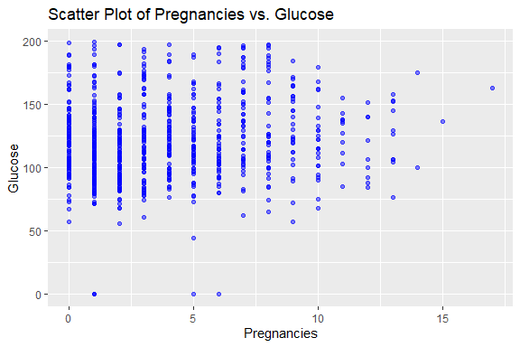<!-- -->

``` r
# Scatter plot for Pregnancies vs. BloodPressure
scatter_plot_2 <- ggplot(pima_data, aes(x = Pregnancies, y = BloodPressure)) +
  geom_point(color = "blue", alpha = 0.5) +
  labs(title = "Scatter Plot of Pregnancies vs. BloodPressure", x = "Pregnancies", y = "BloodPressure")

print(scatter_plot_2)
```

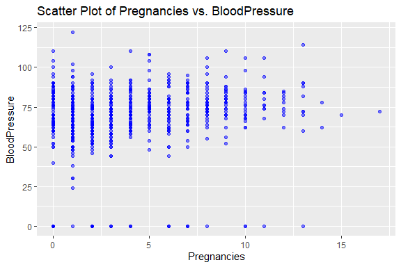<!-- -->

``` r
# Scatter plot for Pregnancies vs. SkinThickness
scatter_plot_3 <- ggplot(pima_data, aes(x = Pregnancies, y = SkinThickness)) +
  geom_point(color = "blue", alpha = 0.5) +
  labs(title = "Scatter Plot of Pregnancies vs. SkinThickness", x = "Pregnancies", y = "SkinThickness")

print(scatter_plot_3)
```

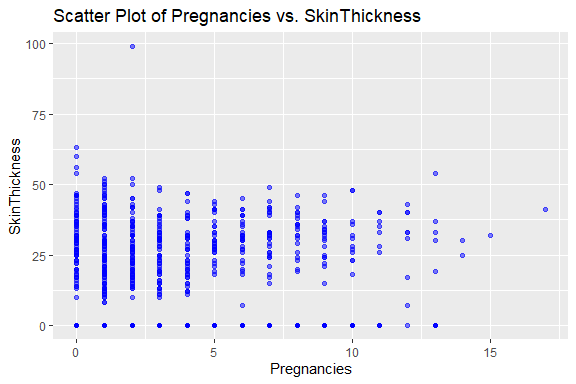<!-- -->

``` r
# Scatter plot for Pregnancies vs. Insulin
scatter_plot_4 <- ggplot(pima_data, aes(x = Pregnancies, y = Insulin)) +
  geom_point(color = "blue", alpha = 0.5) +
  labs(title = "Scatter Plot of Pregnancies vs. Insulin", x = "Pregnancies", y = "Insulin")

print(scatter_plot_4)
```

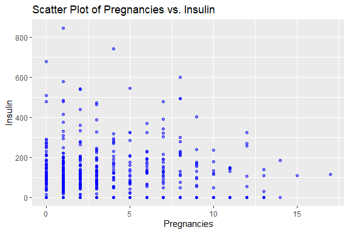<!-- -->

``` r
# Scatter plot for Pregnancies vs. BMI
scatter_plot_5 <- ggplot(pima_data, aes(x = Pregnancies, y = BMI)) +
  geom_point(color = "blue", alpha = 0.5) +
  labs(title = "Scatter Plot of Pregnancies vs. BMI", x = "Pregnancies", y = "BMI")

print(scatter_plot_5)
```

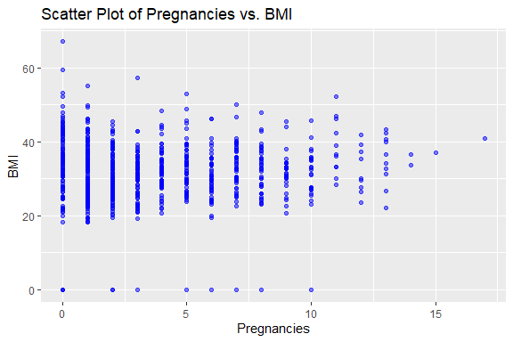<!-- -->

``` r
# Scatter plot for Pregnancies vs. DiabetesPedigreeFunction
scatter_plot_6 <- ggplot(pima_data, aes(x = Pregnancies, y = DiabetesPedigreeFunction)) +
  geom_point(color = "blue", alpha = 0.5) +
  labs(title = "Scatter Plot of Pregnancies vs. DiabetesPedigreeFunction", x = "Pregnancies", y = "DiabetesPedigreeFunction")

print(scatter_plot_6)
```

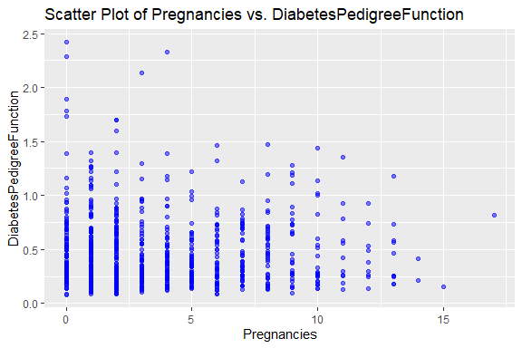<!-- -->

``` r
# Scatter plot for Pregnancies vs. Age
scatter_plot_7 <- ggplot(pima_data, aes(x = Pregnancies, y = Age)) +
  geom_point(color = "blue", alpha = 0.5) +
  labs(title = "Scatter Plot of Pregnancies vs. Age", x = "Pregnancies", y = "Age")

print(scatter_plot_7)
```

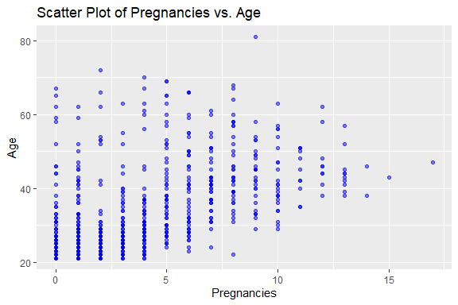<!-- -->

``` r
# Scatter plot for Glucose vs. BloodPressure
scatter_plot_8 <- ggplot(pima_data, aes(x = Glucose, y = BloodPressure)) +
  geom_point(color = "blue", alpha = 0.5) +
  labs(title = "Scatter Plot of Glucose vs. BloodPressure", x = "Glucose", y = "BloodPressure")

print(scatter_plot_8)
```

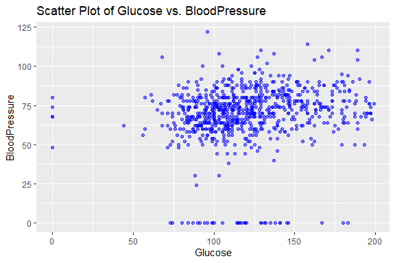<!-- -->

``` r
# Scatter plot for Glucose vs. SkinThickness
scatter_plot_9 <- ggplot(pima_data, aes(x = Glucose, y = SkinThickness)) +
  geom_point(color = "blue", alpha = 0.5) +
  labs(title = "Scatter Plot of Glucose vs. SkinThickness", x = "Glucose", y = "SkinThickness")

print(scatter_plot_9)
```

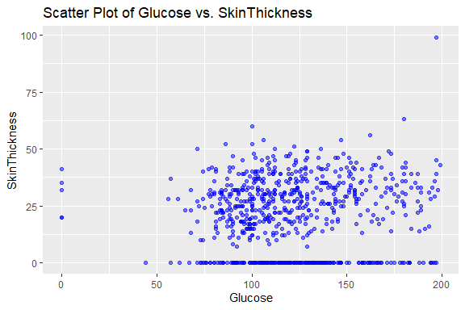<!-- -->

``` r
# Scatter plot for Glucose vs. Insulin
scatter_plot_10 <- ggplot(pima_data, aes(x = Glucose, y = Insulin)) +
  geom_point(color = "blue", alpha = 0.5) +
  labs(title = "Scatter Plot of Glucose vs. Insulin", x = "Glucose", y = "Insulin")

print(scatter_plot_10)
```

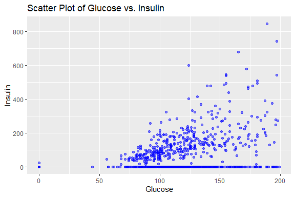<!-- -->

``` r
# Scatter plot for Glucose vs. BMI
scatter_plot_11 <- ggplot(pima_data, aes(x = Glucose, y = BMI)) +
  geom_point(color = "blue", alpha = 0.5) +
  labs(title = "Scatter Plot of Glucose vs. BMI", x = "Glucose", y = "BMI")

print(scatter_plot_11)
```

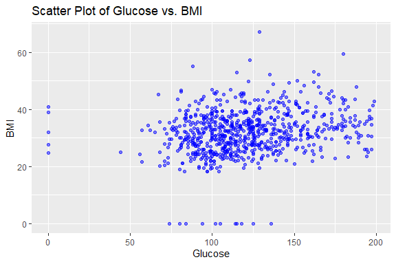<!-- -->

``` r
# Scatter plot for Glucose vs. DiabetesPedigreeFunction
scatter_plot_12 <- ggplot(pima_data, aes(x = Glucose, y = DiabetesPedigreeFunction)) +
  geom_point(color = "blue", alpha = 0.5) +
  labs(title = "Scatter Plot of Glucose vs. DiabetesPedigreeFunction", x = "Glucose", y = "DiabetesPedigreeFunction")

print(scatter_plot_12)
```

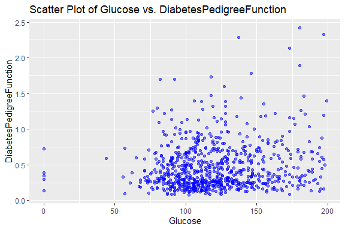<!-- -->

``` r
# Scatter plot for Glucose vs. Age
scatter_plot_13 <- ggplot(pima_data, aes(x = Glucose, y = Age)) +
  geom_point(color = "blue", alpha = 0.5) +
  labs(title = "Scatter Plot of Glucose vs. Age", x = "Glucose", y = "Age")

print(scatter_plot_13)
```

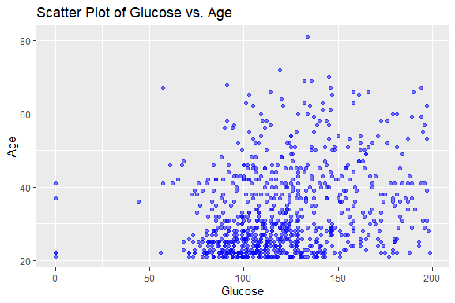<!-- -->

# Preprocessing and Data Transformation

## Check for missing values

``` r
# Check for missing values
missing_values <- colSums(is.na(pima_data))

# Display columns with missing values
print("Columns with missing values:")
```

    ## [1] "Columns with missing values:"

``` r
print(missing_values[missing_values > 0])
```

    ## named numeric(0)

## Normalize Data

``` r
# Load necessary libraries
library(dplyr)
```

    ## 
    ## Attaching package: 'dplyr'

    ## The following objects are masked from 'package:stats':
    ## 
    ##     filter, lag

    ## The following objects are masked from 'package:base':
    ## 
    ##     intersect, setdiff, setequal, union

``` r
# Function to normalize data
normalize_data <- function(data) {
  normalized_data <- data %>%
    mutate_if(is.numeric, function(x) (x - min(x, na.rm = TRUE)) / (max(x, na.rm = TRUE) - min(x, na.rm = TRUE)))
  return(normalized_data)
}

# Apply normalization to numerical variables
normalized_pima_data <- normalize_data(pima_data)

# Display the first few rows of the normalized dataset
head(normalized_pima_data)
```

    ##   Pregnancies   Glucose BloodPressure SkinThickness   Insulin       BMI
    ## 1  0.35294118 0.7437186     0.5901639     0.3535354 0.0000000 0.5007452
    ## 2  0.05882353 0.4271357     0.5409836     0.2929293 0.0000000 0.3964232
    ## 3  0.47058824 0.9195980     0.5245902     0.0000000 0.0000000 0.3472429
    ## 4  0.05882353 0.4472362     0.5409836     0.2323232 0.1111111 0.4187779
    ## 5  0.00000000 0.6884422     0.3278689     0.3535354 0.1985816 0.6423249
    ## 6  0.29411765 0.5829146     0.6065574     0.0000000 0.0000000 0.3815201
    ##   DiabetesPedigreeFunction       Age Outcome
    ## 1               0.23441503 0.4833333       1
    ## 2               0.11656704 0.1666667       0
    ## 3               0.25362938 0.1833333       1
    ## 4               0.03800171 0.0000000       0
    ## 5               0.94363792 0.2000000       1
    ## 6               0.05251921 0.1500000       0

# Training Model

## Splitting Data

``` r
# Load necessary libraries
library(caret)
```

    ## Loading required package: lattice

``` r
# Set seed for reproducibility
set.seed(123)

# Split the data into 70% training and 30% testing
train_indices <- createDataPartition(pima_data$Outcome, p = 0.7, list = FALSE)

# Create training and testing sets
train_data <- pima_data[train_indices, ]
test_data <- pima_data[-train_indices, ]

# Display the dimensions of the training and testing sets
cat("Training data dimensions:", dim(train_data), "\n")
```

    ## Training data dimensions: 538 9

``` r
cat("Testing data dimensions:", dim(test_data), "\n")
```

    ## Testing data dimensions: 230 9

## Bootstrapping

``` r
# Load necessary libraries
library(boot)
```

    ## 
    ## Attaching package: 'boot'

    ## The following object is masked from 'package:lattice':
    ## 
    ##     melanoma

``` r
# Define the function to compute the statistic of interest (mean glucose level)
compute_statistic <- function(data, indices) {
  sample_data <- data[indices, ]
  mean_glucose <- mean(sample_data$Glucose, na.rm = TRUE)
  return(mean_glucose)
}

# Set the number of bootstrap replicates
num_replicates <- 1000

# Perform bootstrapping
bootstrapped_means <- boot(data = pima_data, statistic = compute_statistic, R = num_replicates)

# Display the bootstrapped mean glucose levels
print(bootstrapped_means)
```

    ## 
    ## ORDINARY NONPARAMETRIC BOOTSTRAP
    ## 
    ## 
    ## Call:
    ## boot(data = pima_data, statistic = compute_statistic, R = num_replicates)
    ## 
    ## 
    ## Bootstrap Statistics :
    ##     original     bias    std. error
    ## t1* 120.8945 0.03166146    1.150377

## Cross-validation

``` r
# Load necessary libraries
library(caret)

# Define the control parameters for cross-validation
ctrl <- trainControl(method = "cv",    # Use k-fold cross-validation
                     number = 10)      # Specify the number of folds (e.g., 10-fold)

# Define the predictive model (e.g., linear regression)
model <- train(Outcome ~ .,                # Specify the formula for the model
               data = pima_data,          # Specify the dataset
               method = "glm",            # Specify the modeling method (e.g., generalized linear model)
               trControl = ctrl)          # Specify the control parameters for cross-validation

# Display the cross-validation results
print(model)
```

    ## Generalized Linear Model 
    ## 
    ## 768 samples
    ##   8 predictor
    ##   2 classes: '0', '1' 
    ## 
    ## No pre-processing
    ## Resampling: Cross-Validated (10 fold) 
    ## Summary of sample sizes: 692, 691, 691, 691, 691, 691, ... 
    ## Resampling results:
    ## 
    ##   Accuracy   Kappa   
    ##   0.7733937  0.478162

## Training different models

``` r
# Load necessary libraries
library(caret)

# Define the control parameters for model training
ctrl <- trainControl(method = "cv",   # Use k-fold cross-validation
                     number = 10)     # Specify the number of folds (e.g., 10-fold)

# Train logistic regression model
logistic_model <- train(Outcome ~ .,     # Specify the formula for the model
                        data = pima_data,   # Specify the dataset
                        method = "glm",     # Specify the modeling method (logistic regression)
                        trControl = ctrl)   # Specify the control parameters for cross-validation

# Display the trained logistic regression model
print(logistic_model)
```

    ## Generalized Linear Model 
    ## 
    ## 768 samples
    ##   8 predictor
    ##   2 classes: '0', '1' 
    ## 
    ## No pre-processing
    ## Resampling: Cross-Validated (10 fold) 
    ## Summary of sample sizes: 691, 692, 691, 692, 691, 691, ... 
    ## Resampling results:
    ## 
    ##   Accuracy   Kappa  
    ##   0.7812543  0.49157

``` r
# Train decision tree model
decision_tree_model <- train(Outcome ~ .,       # Specify the formula for the model
                             data = pima_data, # Specify the dataset
                             method = "rpart", # Specify the modeling method (decision trees)
                             trControl = ctrl) # Specify the control parameters for cross-validation

# Display the trained decision tree model
print(decision_tree_model)
```

    ## CART 
    ## 
    ## 768 samples
    ##   8 predictor
    ##   2 classes: '0', '1' 
    ## 
    ## No pre-processing
    ## Resampling: Cross-Validated (10 fold) 
    ## Summary of sample sizes: 691, 692, 692, 691, 691, 691, ... 
    ## Resampling results across tuning parameters:
    ## 
    ##   cp          Accuracy   Kappa    
    ##   0.01741294  0.7540670  0.4343549
    ##   0.10447761  0.7332023  0.3955829
    ##   0.24253731  0.6887218  0.2329194
    ## 
    ## Accuracy was used to select the optimal model using the largest value.
    ## The final value used for the model was cp = 0.01741294.

``` r
# Train SVM model
svm_model <- train(Outcome ~ .,           # Specify the formula for the model
                   data = pima_data,     # Specify the dataset
                   method = "svmRadial", # Specify the modeling method (SVM with radial kernel)
                   trControl = ctrl)     # Specify the control parameters for cross-validation

# Display the trained SVM model
print(svm_model)
```

    ## Support Vector Machines with Radial Basis Function Kernel 
    ## 
    ## 768 samples
    ##   8 predictor
    ##   2 classes: '0', '1' 
    ## 
    ## No pre-processing
    ## Resampling: Cross-Validated (10 fold) 
    ## Summary of sample sizes: 692, 691, 691, 691, 691, 691, ... 
    ## Resampling results across tuning parameters:
    ## 
    ##   C     Accuracy   Kappa    
    ##   0.25  0.7578606  0.4282876
    ##   0.50  0.7695489  0.4637877
    ##   1.00  0.7669344  0.4598216
    ## 
    ## Tuning parameter 'sigma' was held constant at a value of 0.1270684
    ## Accuracy was used to select the optimal model using the largest value.
    ## The final values used for the model were sigma = 0.1270684 and C = 0.5.

## Model performance comparison with resamples

``` r
# Compare model performance using resamples
model_results <- resamples(list(Logistic = logistic_model,
                                Decision_Tree = decision_tree_model,
                                SVM = svm_model))

# Summarize the model performance
summary(model_results)
```

    ## 
    ## Call:
    ## summary.resamples(object = model_results)
    ## 
    ## Models: Logistic, Decision_Tree, SVM 
    ## Number of resamples: 10 
    ## 
    ## Accuracy 
    ##                    Min.   1st Qu.    Median      Mean   3rd Qu.      Max. NA's
    ## Logistic      0.7012987 0.7557245 0.7792208 0.7812543 0.8142943 0.8311688    0
    ## Decision_Tree 0.6363636 0.7175325 0.7402597 0.7540670 0.8066473 0.8831169    0
    ## SVM           0.7142857 0.7370130 0.7763158 0.7695489 0.7792208 0.8441558    0
    ## 
    ## Kappa 
    ##                    Min.   1st Qu.    Median      Mean   3rd Qu.      Max. NA's
    ## Logistic      0.3268719 0.4232862 0.4752379 0.4915700 0.5793557 0.6195363    0
    ## Decision_Tree 0.1876413 0.3294252 0.3963418 0.4343549 0.5484247 0.7319149    0
    ## SVM           0.3267091 0.4066908 0.4669214 0.4637877 0.4899708 0.6457055    0

# Saving Model

``` r
# Saving the best logistic regression model
saveRDS(logistic_model$finalModel, "./models/logistic_model.rds")

# Load the saved model
loaded_logistic_model <- readRDS("./models/logistic_model.rds")

# Prepare new data for prediction (using Pima Indians dataset variables)
new_data <- data.frame(
  Pregnancies = 5,
  Glucose = 130,
  BloodPressure = 70,
  SkinThickness = 30,
  Insulin = 50,
  BMI = 25,
  DiabetesPedigreeFunction = 0.5,
  Age = 40
)

# Use the loaded model to make predictions
predictions_loaded_model <- predict(loaded_logistic_model, newdata = new_data)

# Print predictions
print(predictions_loaded_model)
```

    ##         1 
    ## -0.879332
